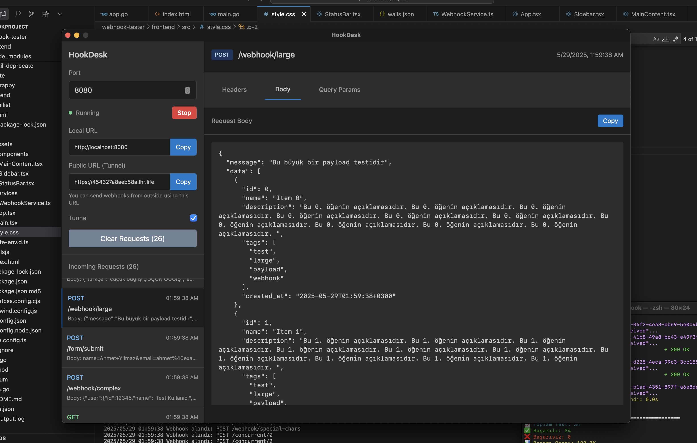
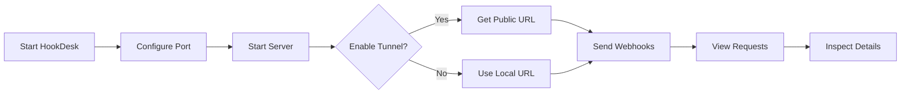

# HookDesk

<div align="center">
  
  
  
  
  
</div>

<br>

<div align="center">
  <h3>🪝 A Modern Desktop Webhook Testing Tool</h3>
  <p>Built with Go, Wails, React & TypeScript</p>
</div>

---

## 📋 Table of Contents

- [About](#about)
- [Features](#features)
- [Screenshots](#screenshots)
- [Installation](#installation)
- [Usage](#usage)
- [Technical Stack](#technical-stack)
- [Development](#development)
- [Contributing](#contributing)
- [License](#license)

## 🎯 About

**HookDesk** is a powerful, modern desktop application designed for testing webhooks with ease. Built with Go and Wails framework, it provides a beautiful JetBrains IDE-inspired dark interface for developers to capture, inspect, and debug webhook requests in real-time.

Whether you're developing webhook integrations, testing API callbacks, or debugging third-party services, HookDesk makes the process seamless with its intuitive interface and powerful features.

## ✨ Features

### 🚀 Core Functionality
- **Real-time Webhook Capture**: Instantly receive and display HTTP requests
- **Multiple HTTP Methods**: Support for GET, POST, PUT, DELETE, PATCH, and more
- **Port Configuration**: Customizable local server port (default: 8080)
- **Public URL Tunneling**: Expose local webhooks via localhost.run integration
- **Runtime Tunnel Toggle**: Enable/disable public access on-the-fly

### 🔍 Request Inspection
- **Detailed Request View**: Headers, body, and query parameters
- **JSON Formatting**: Automatic JSON prettification
- **Syntax Highlighting**: Color-coded HTTP methods
- **Copy to Clipboard**: One-click copying of URLs, headers, and content
- **Scrollable Content**: Handle large payloads with smooth scrolling

### 🎨 User Interface
- **Modern Dark Theme**: JetBrains IDE-inspired design
- **Responsive Layout**: Optimized for different screen sizes
- **Tabbed Interface**: Organized view of request details
- **Real-time Updates**: Live request list with timestamps
- **Status Indicators**: Visual webhook server status

### 🛠 Developer Experience
- **Zero Configuration**: Works out of the box
- **Cross-platform Ready**: Built with Wails for multi-platform support
- **Lightweight**: Native performance with minimal resource usage
- **No External Dependencies**: Self-contained executable

## 📱 Screenshots

<div align="center">
  
  <p><em>HookDesk - Modern Webhook Testing Interface</em></p>
</div>

## 🚀 Installation

### Prerequisites
- macOS 10.15+ (Catalina or later)
- No additional dependencies required

### Download & Install

1. **Download the latest release** from the [Releases](https://github.com/enderkus/hookdesk/releases) page
2. **Extract the archive** to your Applications folder
3. **Run HookDesk.app** by double-clicking or via terminal:
   ```bash
   ./HookDesk.app/Contents/MacOS/HookDesk
   ```

### Build from Source

```bash
# Clone the repository
git clone https://github.com/enderkus/hookdesk.git
cd hookdesk

# Install dependencies
go mod tidy
cd frontend && npm install && cd ..

# Build the application
wails build

# Run the built application
./build/bin/HookDesk.app/Contents/MacOS/HookDesk
```

## 🎮 Usage

### Getting Started

1. **Launch HookDesk** from your Applications folder
2. **Configure Port** (optional): Set your preferred port in the sidebar (default: 8080)
3. **Start Webhook Server**: Click the "Start" button
4. **Copy Local URL**: Use `http://localhost:8080` for local testing
5. **Enable Tunnel** (optional): Toggle the tunnel switch for public access
6. **Send Requests**: Use the provided URLs to send webhook requests

### Basic Workflow



### Example Usage

1. **Start the webhook server** on port 8080
2. **Copy the local URL**: `http://localhost:8080`
3. **Send a test request**:
   ```bash
   curl -X POST http://localhost:8080/webhook \
     -H "Content-Type: application/json" \
     -d '{"message": "Hello from HookDesk!", "timestamp": "2024-01-01T12:00:00Z"}'
   ```
4. **View the request** in HookDesk's interface
5. **Inspect headers, body, and query parameters** in the detailed view

### Tunnel Integration

HookDesk integrates with **localhost.run** to provide public URLs:

- **Automatic Setup**: No account or configuration needed
- **Secure Tunneling**: HTTPS endpoints for webhook testing
- **Runtime Control**: Enable/disable without restarting the server
- **URL Copying**: One-click copy for easy sharing

## 🛠 Technical Stack

### Backend
- **Go 1.19+**: Core application logic
- **Wails v2**: Desktop framework for Go + Web frontend
- **Gorilla Mux**: HTTP router and URL matcher
- **SSH Tunneling**: localhost.run integration

### Frontend
- **React 18.2.0**: UI framework
- **TypeScript**: Type-safe JavaScript
- **Server-Sent Events (SSE)**: Real-time request streaming
- **Custom CSS**: JetBrains-inspired dark theme

### Architecture
- **Embedded Frontend**: Single executable with embedded web assets
- **Native Performance**: Direct system integration via Wails
- **Real-time Communication**: SSE for live request updates
- **Modular Design**: Separated concerns for maintainability

## 🔧 Development

### Setup Development Environment

```bash
# Install Wails CLI
go install github.com/wailsapp/wails/v2/cmd/wails@latest

# Clone and setup
git clone https://github.com/enderkus/hookdesk.git
cd hookdesk

# Install dependencies
go mod tidy
cd frontend && npm install && cd ..

# Run in development mode
wails dev
```

### Development Commands

```bash
# Frontend development
cd frontend
npm run dev          # Start Vite dev server
npm run build        # Build for production
npm run preview      # Preview production build

# Backend development
go run .             # Run Go application directly
go build             # Build Go binary

# Full application
wails dev            # Development mode with hot reload
wails build          # Production build
wails build -debug   # Debug build with devtools
```

### Project Structure

```
hookdesk/
├── app.go              # Main application logic
├── main.go             # Application entry point
├── wails.json          # Wails configuration
├── frontend/           # React frontend
│   ├── src/
│   │   ├── components/ # React components
│   │   ├── services/   # API services
│   │   └── style.css   # Custom styles
│   ├── package.json    # Frontend dependencies
│   └── vite.config.ts  # Vite configuration
└── build/              # Build output
    └── bin/            # Compiled binaries
```

## 🤝 Contributing

We welcome contributions to HookDesk! Here's how you can help:

### Bug Reports
- Use the [GitHub Issues](https://github.com/enderkus/hookdesk/issues) page
- Include detailed reproduction steps
- Provide system information and logs

### Feature Requests
- Open an issue with the "enhancement" label
- Describe the feature and its use case
- Consider contributing the implementation

### Pull Requests
1. Fork the repository
2. Create a feature branch: `git checkout -b feature/amazing-feature`
3. Commit your changes: `git commit -m 'Add amazing feature'`
4. Push to the branch: `git push origin feature/amazing-feature`
5. Open a Pull Request

### Development Guidelines
- Follow Go coding standards
- Use TypeScript for frontend development
- Add tests for new functionality
- Update documentation as needed

## 📄 License

This project is licensed under the MIT License - see the [LICENSE](LICENSE) file for details.

## 🙏 Acknowledgments

- **Wails Framework**: For providing an excellent Go + Web framework
- **localhost.run**: For free tunnel service integration
- **JetBrains**: For design inspiration
- **Go Community**: For excellent tooling and libraries
- **React Community**: For powerful frontend framework

## 📞 Support

- **GitHub Issues**: [Report bugs or request features](https://github.com/enderkus/hookdesk/issues)
- **Discussions**: [Community discussions](https://github.com/enderkus/hookdesk/discussions)
- **Email**: enderkus@msn.com

## ☕ Support the Project

If you find HookDesk useful and want to support its development, consider buying me a coffee!

<div align="center">
  <a href="https://buymeacoffee.com/enderk" target="_blank">
    
  </a>
</div>

Your support helps keep the project alive and enables new features! 🚀

---

<div align="center">
  <p>Made with ❤️ by <a href="https://github.com/enderkus">Ender KUŞ</a></p>
  <p>
    <a href="https://github.com/enderkus/hookdesk">⭐ Star this repository</a> if you find it helpful!
  </p>
</div>
